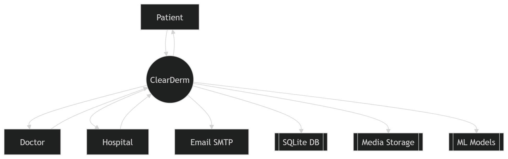
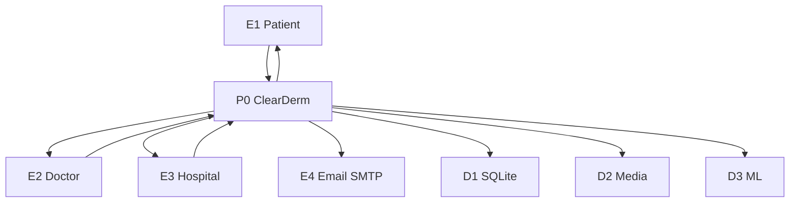
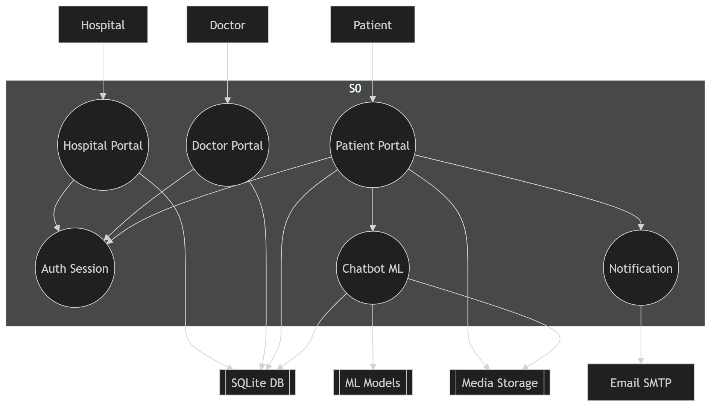
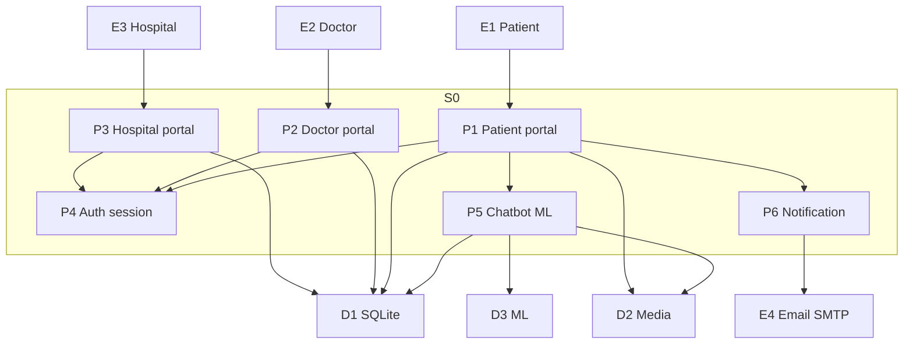
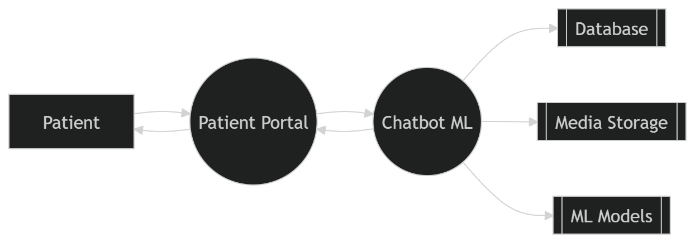
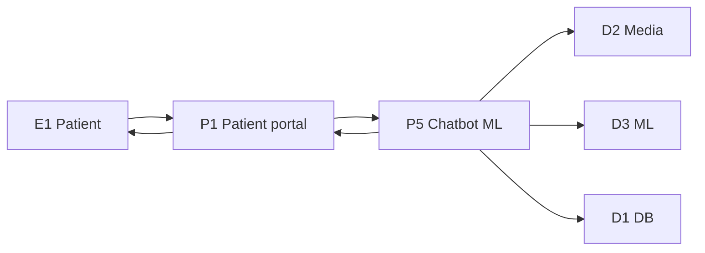

# Project Report: ClearDerm (Dermatology Diagnosis and Consultation System)

**Date:** 2026-03-25  
**Repository folder:** `Dermatology`  
**Application root (run commands here):** `Dermatological_Diagnosis_and_Consultation_System/`  
**Django project package:** `dermatology_system`  
**Django apps in this codebase:** `patient`, `doctor`, `hospital`  
**Default database:** SQLite file `db.sqlite3` next to `manage.py`

## 1. Overview
ClearDerm is a web application that supports:
- **Patient portal**: registration/login, dashboard, appointments, prescriptions, and AI chatbot for guidance.
- **Doctor portal**: registration/login and doctor dashboard (appointments/schedules + prescriptions).
- **Hospital portal**: registration/login and hospital dashboard (doctor management + related views).

The application includes an ML component for **skin disease classification** and integrates it into the **AI chatbot** flow.

## 2. Tech Stack
Values below match `requirements.txt` in the application root.

- **Backend:** Django 4.2.7 (SQLite default via `DATABASES` in `dermatology_system/settings.py`)
- **Frontend:** Bootstrap 5.3.x (loaded from CDN in templates)
- **ML:** TensorFlow (≥2.13), NumPy, Pillow
- **Training / utilities:** scikit-learn, matplotlib (used by scripts under `ml_model/`)

## 3. Repository Layout (high level)
Key components:
- `manage.py` (run Django)
- `dermatology_system/` (Django project settings, URLs)
- `patient/`, `doctor/`, `hospital/` (Django apps)
- `templates/` (HTML templates)
- `static/` (static assets; configured via `STATICFILES_DIRS`)
- `ml_model/` (training + prediction utilities)

## 4. Main Features
### 4.1 Authentication & Portals
All three portals (Patient/Doctor/Hospital) include:
- Registration + login using Django auth patterns
- Dashboard after successful login
- Logout route

### 4.2 Patient Dashboard
The patient dashboard includes:
- Account information
- Navigation to appointments and prescriptions
- An **AI Chatbot** section: primary action is **Chat with AI Assistant**, linking to the full chatbot view (`chatbot` URL → `patient/chatbot/`). The page also contains an optional **in-page chatbot modal** (the top navbar Chatbot control is hidden; the modal markup remains on the template)

### 4.3 AI Chatbot + ML Prediction
The chatbot supports:
- Text questions
- Optional image upload (skin image) for ML-assisted prediction

The ML prediction is handled by:
- `ml_model/predict.py` (loads model + class indices, preprocesses images, returns top-N predictions)
- `patient/views.py` (calls the predictor from the chatbot API flow when an image is provided)

## 5. Key Implementation Details
### 5.1 Lazy TensorFlow Loading (management command friendly)
To prevent TensorFlow from loading during Django management commands (like `makemigrations` / `check`), the ML module was changed to:
- Defer TensorFlow import until prediction time (`_ensure_tf()` in `ml_model/predict.py`)
- Lazy-import the predictor function in `patient/views.py` only when needed

This prevents TensorFlow “oneDNN/absl” stderr noise and reduces startup overhead for non-ML commands.

### 5.2 Static Files Configuration
`STATICFILES_DIRS` points to `BASE_DIR / "static"`.
- `static/` was ensured to exist so Django no longer warns about a missing directory.

### 5.3 Navbar Behavior (Chatbot tab removal)
The patient dashboard **navbar/tab** was updated so the **Chatbot** button is hidden from the navigation links only.
- This does not remove the chatbot feature itself:
  - The AI Chatbot section remains in the dashboard content.
  - The full chatbot page (`patient/chatbot.html`) remains available.

## 6. Setup & Run Instructions
1. Create and activate a virtual environment (example):
   ```bash
   python -m venv venv
   venv\Scripts\activate
   ```
2. Install dependencies:
   ```bash
   pip install -r requirements.txt
   ```
3. Database migrations:
   ```bash
   python manage.py makemigrations
   python manage.py migrate
   ```
4. Run server:
   ```bash
   python manage.py runserver
   ```

## 7. Verification Performed
- After ensuring the `static/` directory exists, `python manage.py check` and `python manage.py makemigrations` run without the previous static-files warning.
- Confirmed the chatbot ML path is only executed when a prediction is requested (image upload).

## 8. Known Notes / Considerations
- **TensorFlow logs:** On first ML prediction, TensorFlow may print informational oneDNN/absl lines to stderr; these are not Django errors. Optional: set `TF_ENABLE_ONEDNN_OPTS=0` in the environment to reduce noise.
- **Security / configuration:** Email (OTP) and any API keys should be supplied via **environment variables** in production (`EMAIL_HOST_USER`, `EMAIL_HOST_PASSWORD`, etc., as already supported in `settings.py`). Do not commit real secrets to git.

## 9. Next Steps (Optional)
- Add automated tests for authentication flows and chatbot API responses.
- Add a dedicated CI pipeline to run `python manage.py check` and migration checks.
- Move all secrets to environment variables and add `.env` handling (with secrets excluded from git).

## 10. Data Flow Diagram (DFD)

**Scope:** This report includes **three** DFDs only—**Level 0**, **Level 1**, and **Level 2**. There is **no Level 3** (or deeper) decomposition here.

| Level | What it shows |
|-------|----------------|
| **0** | Context: whole system **P0** vs external entities and data stores |
| **1** | **P0** split into processes **P1–P6** |
| **2** | Detail for patient **chatbot + ML** (**P1** ↔ **P5** ↔ **D1–D3**) |

**DFD summary (quick reference)**

| DFD level | Figure file (`static/`) | Report subsection | What the diagram shows | Main symbols |
|-----------|-------------------------|-------------------|-------------------------|--------------|
| **0** | `dfd-level-0.png` | §10.1 | One system **ClearDerm** (**P0**) with **Patient**, **Doctor**, **Hospital**, **Email SMTP**, and data stores **SQLite / Media / ML** | P0, E1–E4, D1–D3 |
| **1** | `dfd-level-1.png` | §10.2 | **P0** opened into **Patient / Doctor / Hospital portals**, **Auth session**, **Chatbot ML**, **Notification**, and stores | P1–P6, E1–E4, D1–D3 |
| **2** | `dfd-level-2.png` | §10.3 | Zoom: **Patient** ↔ **Patient Portal** ↔ **Chatbot ML** → **Database**, **Media**, **ML models** | E1, P1, P5, D1–D3 |

**Diagram labels vs report IDs** (same meaning, different wording on the figure)

| Label often used on PNG | ID in this report |
|---------------------------|-------------------|
| ClearDerm | **P0** (Level 0 only) |
| Patient / Doctor / Hospital | **E1**, **E2**, **E3** |
| Email SMTP | **E4** |
| SQLite / SQLite DB / Database | **D1** |
| Media / Media storage | **D2** |
| ML / ML models / ML artifacts | **D3** |
| Patient portal | **P1** (Level 1–2) |
| Chatbot ML | **P5** |

**Client-ready summary image:** `static/dfd-summary-tables-client.png` (generated with `python scripts/export_dfd_summary_png.py` from the app root; requires matplotlib).

Each level below includes: narrative, **tables**, PNG figures in **`static/`** (`dfd-level-0.png` … `dfd-level-2.png`), and optional **Mermaid** for tooling. Symbols: **E** = external entity, **P** = process, **D** = data store. Diagram PNGs use plain-language labels (e.g. “Media Storage”); this report maps them to **D2** / **D3**. Optional Mermaid blocks must use the **` ```mermaid `** fence (not ` ```json `).

---

### 10.1 DFD Level 0 — Context diagram (system boundary)

**Purpose:** One process **P0** (the whole application) with external entities and data stores.

**Elements**

| ID | Element | Type | Description |
|----|---------|------|-------------|
| E1 | Patient | External entity | Registers, logs in, books appointments, views prescriptions, uses chatbot / image upload |
| E2 | Doctor | External entity | Logs in, manages schedules/appointments, creates prescriptions |
| E3 | Hospital | External entity | Logs in, manages hospital profile and linked doctors |
| E4 | Email (SMTP) | External entity | Sends OTP and notification emails |
| P0 | **ClearDerm System** | Process (system) | Django web app: portals, business logic, persistence, chatbot API, ML prediction |
| D1 | SQLite DB | Data store | Users, patients, doctors, hospitals, appointments, messages, prescriptions, etc. |
| D2 | Media / uploads | Data store | Uploaded images (e.g. chatbot uploads under `MEDIA_ROOT`) |
| D3 | ML artifacts | Data store | `skin_disease_model.h5`, `class_indices.json` (under `ml_model/models/`, large files may be gitignored) |

**Flows (summary)**

| From | To | Data flow name | Typical data |
|------|-----|----------------|--------------|
| E1 | P0 | Login / registration request | Credentials, profile fields, OTP |
| P0 | E1 | Web pages / JSON responses | Dashboard, chatbot replies, validation errors |
| P0 | E4 | Send email | OTP, recipient address |
| E4 | P0 | (implicit delivery) | — |
| E2 | P0 | Doctor actions | Schedules, appointment updates, prescriptions |
| P0 | E2 | Doctor UI / confirmations | Lists, success/error messages |
| E3 | P0 | Hospital actions | Doctor linkage, hospital profile updates |
| P0 | E3 | Hospital UI / confirmations | Lists, success/error messages |
| P0 | D1 | Read / write persistent data | ORM queries (all modules) |
| P0 | D2 | Store / read uploads | Image files for chatbot |
| P0 | D3 | Load model | Model file + class index for prediction |

**Level 0 — Figure (PNG, `static/dfd-level-0.png`)**



**Level 0 — Mermaid diagram**

Uses only **plain rectangles**, **one-way arrows** (`-->`), and **no edge labels** so it works on older Mermaid and strict validators. If Mermaid still fails in your editor, use the **ASCII sketch** below or paste into [mermaid.live](https://mermaid.live).



**Level 0 — ASCII (always works)**

```
        +----------+          +------------------+
        | E1 Patient|--------|                  |--------> D1 SQLite
        +----------+          |                  |
        +----------+          |  P0 ClearDerm   |--------> D2 Media
        | E2 Doctor |--------|                  |
        +----------+          |                  |--------> D3 ML
        +----------+          +--------+---------+
        | E3 Hospital|--------|        |
        +----------+                   v
                                    E4 SMTP
```

(Arrows are simplified; E1–E3 also receive responses from P0 in the real DFD.)

---

### 10.2 DFD Level 1 — Decomposition of P0

**Purpose:** Split **P0** into major processes **P1–P6**, show external entities and data stores used at this level.

**Processes (inside P0)**

| ID | Process name | Description | Inputs | Outputs |
|----|----------------|-------------|--------|---------|
| P1 | Patient portal | Registration (OTP), login, dashboard, appointments, prescriptions, chatbot UI/API | HTTP from E1 | HTML/JSON, writes to D1/D2 |
| P2 | Doctor portal | Login, schedules, appointments, prescriptions | HTTP from E2 | HTML/JSON, writes to D1 |
| P3 | Hospital portal | Login, hospital/doctor management | HTTP from E3 | HTML/JSON, writes to D1 |
| P4 | Authentication & session | Validate users, enforce portal isolation | Credentials | Session, user identity |
| P5 | Chatbot & ML service | `chatbot_api`: text + optional image; calls predictor | Messages, image file | Bot reply, optional ML prediction |
| P6 | Notification (email) | OTP / transactional mail via SMTP | Recipient, OTP body | Outbound mail to E4 |

**Data stores (Level 1)**

| ID | Name | Contents (examples) |
|----|------|---------------------|
| D1 | Application database (`db.sqlite3`) | `auth_user`, patient/doctor/hospital profiles, appointments, chat messages, prescriptions, pending OTP registration |
| D2 | Media storage | User-uploaded images (paths under `MEDIA_ROOT`) |
| D3 | ML model storage | Trained Keras model + `class_indices.json` |

**Level 1 — Figure (PNG, `static/dfd-level-1.png`)**



**Level 1 — Mermaid diagram**



---

### 10.3 DFD Level 2 — Patient chatbot + ML (detail of P1 ↔ P5)

**Purpose:** Zoom into **P1** (patient portal) and **P5** (chatbot & ML) with **D1–D3** for the image-assisted chatbot path.

**Flows**

| From | To | Data flow | Description |
|------|-----|-----------|-------------|
| E1 | P1 | Chat message + optional image | POST to `chatbot_api` (`/patient/chatbot/api/`) |
| P1 | P5 | Forward request | Text + multipart image to `chatbot_api` |
| P5 | D2 | Read image path | Temporary saved upload |
| P5 | D3 | Load classifier | Model + indices |
| P5 | D1 | Persist chatbot turns | `patient_chatmessage` (model `ChatMessage`) |
| P5 | P1 | API JSON | Reply text + optional `ml_prediction` |
| P1 | E1 | HTTP response | Rendered bot message in UI |

> **Note:** Flows match the implemented routes in `patient/urls.py` and views `chatbot_api` / `chatbot_view`; ML uses `ml_model/predict.py` when an image is posted.

**Level 2 — Figure (PNG, `static/dfd-level-2.png`)**



**Level 2 — Mermaid diagram**



*(End of DFD levels 0–2.)*

---

## 11. Database design — key tables (this project)

Django creates table names as **`app_label_modelname`** (lowercase). Authentication uses Django’s **`auth_user`** (and related `auth_*` tables). Each portal profile is a separate model/table linked with **`OneToOneField(User)`**.

**Client-ready image:** `static/database-design-clearerm-client.png` — regenerate from the app root with `python scripts/export_database_sample_png.py` (requires matplotlib). The PNG lists the **four core** profile/login tables.

### 11.1 `auth_user` (Django built-in)

| Fieldname | Datatype | Key / notes |
|-----------|----------|-------------|
| id | integer | Primary key |
| username | varchar(150) | unique |
| email | varchar(254) | |
| password | varchar(128) | hashed |
| first_name | varchar(150) | |
| last_name | varchar(150) | |
| is_active | boolean | |
| date_joined | datetime | |

### 11.2 `patient_patient`

| Fieldname | Datatype | Key / notes |
|-----------|----------|-------------|
| id | integer | Primary key |
| user_id | integer | OneToOne → `auth_user` |
| age | integer | |
| gender | varchar(1) | M / F / O |
| phone_number | varchar(15) | nullable |
| date_of_birth | date | nullable |
| address | text | nullable |
| created_at | datetime | auto |

### 11.3 `doctor_doctor`

| Fieldname | Datatype | Key / notes |
|-----------|----------|-------------|
| id | integer | Primary key |
| user_id | integer | OneToOne → `auth_user` |
| license_number | varchar(50) | unique |
| specialization | varchar(50) | |
| phone_number | varchar(15) | |
| years_of_experience | integer | |
| hospital_id | integer | FK → `hospital_hospital`, nullable |
| created_by_hospital | boolean | |
| created_at | datetime | auto |

### 11.4 `hospital_hospital`

| Fieldname | Datatype | Key / notes |
|-----------|----------|-------------|
| id | integer | Primary key |
| user_id | integer | OneToOne → `auth_user` |
| hospital_name | varchar(200) | |
| registration_number | varchar(50) | unique |
| address | text | |
| phone_number | varchar(15) | |
| email | varchar(254) | |
| total_beds | integer | |
| created_at | datetime | auto |

### 11.5 Other application tables (summary)

| Django model (app) | Database table (typical) | Role |
|---------------------|---------------------------|------|
| `PendingPatientRegistration` | `patient_pendingpatientregistration` | OTP pending signup |
| `Appointment` | `patient_appointment` | Bookings |
| `AppointmentChatMessage` | `patient_appointmentchatmessage` (`Meta.db_table`) | Online appointment chat |
| `ChatMessage` | `patient_chatmessage` | AI chatbot history |
| `Prescription` | `patient_prescription` | Prescriptions |
| `AppointmentSchedule` | `doctor_appointmentschedule` | Doctor availability |

Run `python manage.py showmigrations` and inspect `db.sqlite3` (or use Django admin) for the exact schema after migrations.

## 12. Key URLs (local development, `runserver` default)

| Area | URL path | Notes |
|------|----------|--------|
| Home | `/` | `patient` app routes at site root (`dermatology_system/urls.py`) |
| Patient login | `/patient/` | |
| Patient register | `/patient/register/` | OTP flow |
| Patient dashboard | `/patient/dashboard/` | |
| Chatbot page | `/patient/chatbot/` | name `chatbot` |
| Chatbot API | `/patient/chatbot/api/` | name `chatbot_api` |
| Doctor area | `/doctor/…` | under `doctor/urls.py` |
| Hospital area | `/hospital/…` | under `hospital/urls.py` |
| Admin | `/admin/` | Django admin |

